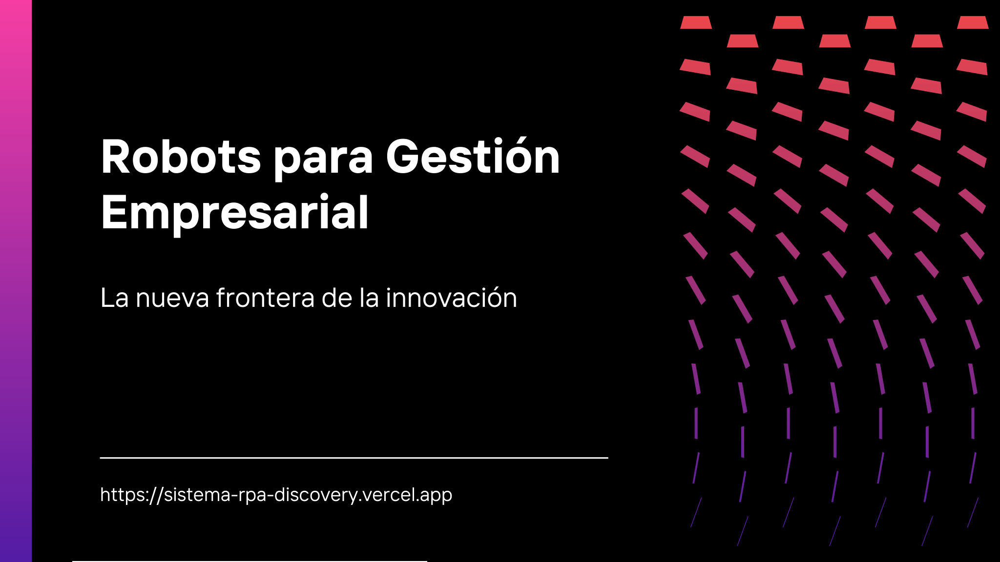

# 🤖 Sistema RPA - Data Discovery Solutions S.A.C.



Sistema RPA Discovery es una plataforma moderna desarrollada con Next.js para la automatización inteligente de procesos empresariales. Permite descubrir, gestionar y optimizar flujos de trabajo mediante bots y soluciones de RPA (Robotic Process Automation).

## Características
- Arquitectura profesional con Next.js y Tailwind CSS
- SEO optimizado y diseño responsivo
- Ejemplos de bots para trading, moderación y APIs
- Ecosistema abierto para contribuciones
- Navegación rápida y moderna

## Instalación

1. Clona el repositorio:
	```bash
	git clone https://github.com/ArcGabicho/sistema-rpa-discovery.git
	```
2. Abre la carpeta:
    ```bash
    cd sistema-rpa-discovery
    ```
3. Instala las dependencias:
	```bash
	npm install
	```
4. Inicia el servidor de desarrollo:
	```bash
	npm run dev
	```

## Estructura del Proyecto
```
app/         # Componentes y páginas principales
public/      # Imágenes y recursos estáticos
styles/      # Archivos CSS globales
```

## Scripts Disponibles
- `npm run dev` — Inicia el servidor de desarrollo
- `npm run build` — Compila la aplicación para producción
- `npm run start` — Inicia la app en modo producción

## Licencia
Este proyecto está bajo la licencia MIT.